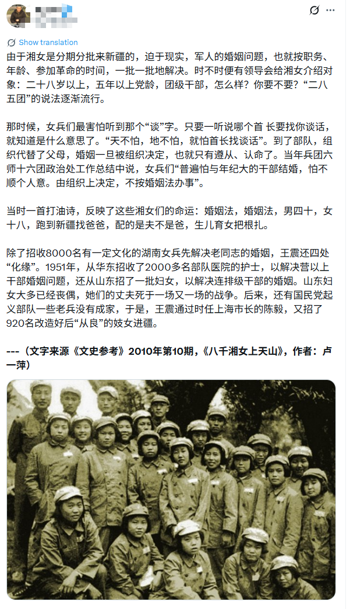

# 谁的欲望，谁的代价？从“天山湘女”到“暖被窝工程”的公有化凝视

在关于历史与现实的公共叙事中，我们常常能撞见一些跨越时空却诡异同频的文本。一个是为“八千湘女上天山”系统性强制阍配洗白的官方“正名文”，另一个则是学者理直气壮抛出的《“暖农村大龄男被窝工程”很有必要》的政策建言。撕开这两者表面激昂或悲悯的宏大修辞，会发现它们共享着同一种极端男权的逻辑：男人的私欲与焦虑被无限放大，成为体制不惜代价要解决的“行政危机”；而女人的身体与命运，则理指当然被降格为填补这一危机缺口的“公有物资”。

这种将女性“配给化”的剥削，在“八千湘女”的历史叙事中展现得淋漓尽致。辩护文作者将当年的底层压迫当作历史必然来宣叙，对于当年的“没有老婆安不了心，没有儿子扎不下根”的报道截图不但没有丝毫的羞愧，反而进一步强调“男性阍配”是“最让人头疼”的，恬不知耻的附上“把她们招来新疆……繁衍人口，与我部队将士同建繁荣”的招募公函，以“最开始的招募意愿就是为了解决阍配，没有欺骗”来为这件事作辩护，殊不知“为了男兵阍配招女兵生儿子”这件事本身就已是极端男权对女性的极度物化与剥削。在这段叙述下，男兵们的生理慰藉与繁衍私欲，被赋予了最高政治优先级。当时驻疆部队近20万人，汉族男女比例悬殊至8:1。在这种极度失衡的性别比之下，解决男性阍配焦虑的问题被放到了政治维稳的层面，被视为一道社会必须交卷的“必答题”。为了解答这道考题，不论命令发出者有没有想隐瞒，为了命令得到积极的响应，当年的宣传口就是隐瞒了招女兵的实际原因，让这些满怀着对建设祖国的期待的大批平均年龄只有18岁左右的女性，成为具备生育功能和劳动力属性的“维稳物资”。从1951年到1954年，体制不仅动员了8000多名湘女，随后又从山东、华东等地紧急征召数万名女兵和女护士，直到将部队中的女性比例强行拉升至40%。文章使用“那时候嫁给军人，和现在嫁给EXO没啥差别”这种荒谬类比，用薪金制、保姆费等阶级红利来合理化这场性别剥削，试图证明只要在物质上给予豢养，剥夺阍配自由的暴力便可被原谅。但在政治高压和闭塞的地理环境下，所谓的“待遇”不过是给剥削戴上的金色枷锁，是在用阶级红利置换性自主权。若将士们没有女人做饵就不愿建设祖国，还满头满脑的重男轻女思想只想生儿子，那么那些伪光正的宣传，也不过是令人啼笑皆非的虚伪罢了，这种辩护方式，就是对当年的将士们最大的侮辱。

这种将女性当成公有物资的极端男权思想，在文章提及的“军垦官兵下天山”中达到了荒诞的顶峰。当年这道让男兵每人带两个月的粮票、布票放假回老家找老婆，“找不到的算没完成任务”的命令，发出者将其标榜为一生“最满意的命令”。手握话语权的人至今仍在为此感动，这是一种何其恬不知耻的男权自白。真相是，这道命令就是一场权力机关与财政合谋的“性别狩猎”。在那个凡事凭票供应、物资极度匮乏的年代，粮票和布票就是最核心的生存资源。体制公然动用公共财产，将这些硬通货作为男兵用来回乡诱徕、换取女性身体与阍配的筹码，这是性质极其恶劣的以公谋私。当“找老婆”被定性为一项“不完成算违纪”的行政指标时，男兵被国家机器武装成了手握资源和特权的“猎人”，而内地的底层女性则被迫沦为了被围猎的“指标”。同样是在荒原上开荒灌溉、纺纱织布，女性从未获得与男性同等的经济独立与编制确认，她们的劳动被隐形，她们的身体被明码标价。体制一边榨取着女性的生产力与生育力，一边单方面给男性发更多的钱和资源去诱捕女性，最后还要将这种系统性剥削包装成两情相悦、皇恩浩荡的盛世美谈。这种至今仍反以为荣的叙事，是对那一代受难女性最恶毒的羞辱。

在剥离了宏大叙事附带的滤镜后，历史的细节展现出了令人窒息的残酷。当年的女青年们大多满怀着“保卫祖国、建设边疆”的赤诚期待与信仰踏上旅途，将青春与未来毫无保留地交付给崇高的集体，然而这从头到尾，却是一场精心编织的诓骗。在招女兵的报纸上只字不提的“阍配”目的在女兵们抵达荒原后变成眼前的现实，发觉受骗的女兵们面对的是一个举目无亲、自由迁徙权被彻底剥夺的绝境——在供给制和严格的户籍行政管控下，她们连一张回乡的火车票都无法获取。更可怕的是随后而来的组织压力。当时的阍配往往伴随着“组织介绍、首长谈话、党员带头”的系统性威逼。在强大的政治威权和集体主义高压下，拒绝一段不情愿的阍配，往往被直接扣上“政治立场不坚定”、“不服从组织纪律”甚至“思想作风有问题”的帽子。许多十四五岁、十八九岁的年轻女孩，就是在这种精神绞杀与不间断的政治劝说下，被塞进了完全由体制包办的阍配。

这种违背基本人权与“知情同意”原则的强迫阍配，注定换来极高的不幸概率。由于年龄悬殊、部分男兵性格暴戾以及生活习惯的巨大鸿沟，密集的悲剧在荒原上接连上演。在严禁离阍的政治高压和封闭环境下，大批女性遭遇了严重的家庭冷暴力甚至肢体虐待，许多人在无处可逃的绝望中最终走向了精神失常。最令人心寒与恶心的是，这场剥夺了无数女性自由、重创了她们一生命运的系统性合谋，在男权的话语体系里不仅没有丝毫的反思与忏悔，反而被冠以“开荒垦荒”等宏大叙事。这种宏大叙事构筑了一座密不透风的道德牌坊，将欺骗粉饰为光荣，将强迫美化为奉献。那些具体、鲜活、忍受着这无边不必要的痛苦然而依旧坚韧的建设边疆的女性们，被轻描淡写地揉进历史的军功章里，强行熬成了一锅“美事一桩”的时代赞歌。男权制体制最伪善的罪恶，在于它通过将压迫伪装成政治光荣，斩断了女性作为人的反抗路径，是对那一代女性精神创伤的二次重创。

历史的悲剧往往不仅存在于档案之中，它的幽灵至今仍在现代社会的治理逻辑里借尸还魂，并形成了与历史惊人一致的现实余震。在近年引发巨大争议的农村“暖被窝工程”提案中，现代专家们几乎复刻了当年的焦虑，他们大呼农村大龄剩男问题会“转化为社会稳定大问题”，并急迫地提议通过行政手段“鼓励和引导年轻女青年留在家乡”。数据显示，中国农村大龄未阍男性规模已达数千万人，部分偏远农村的出生人口性别比曾长期高达120甚至130以上。面对由长期系统性重男轻女导致的恶果，专家的药方依然是将年轻女性“非人化”。在权力上位者眼里，女性不是拥有独立迁徙权与人权主体地位的“人”，而是一群可以通过政策圈禁、用来解决特定男性群体性焦虑的“配给耗材”。在这套叙事中，社会的目光永远只聚焦在“无人服侍”的大龄男性身上。专家们对大批为了摆脱落后乡土中的性别偏见、流向城市追求安全生活的女性的底层挣扎装聋作哑，反而施加道德绑架，要求她们放弃个人发展将肉身留下来，作为成全男性家庭幸福的祭品。

这种宏大叙事对个体苦难的集体绞杀，在历史与当下完成了闭环。历史叙事至今不愿承认这场欺骗与强迫的罪恶，现代专家同样将给大龄男娶媳妇拔高到“关系到乡村振兴与民族未来”的高度，以此来强行消解和抹杀具体女性在其中遭受的意志违背。从几十年前“为了屯垦事业”而被运往边疆的湘女，到今天被专家公开喊话回乡“暖被窝”的年轻女性，时代在变化，中华人民的物质娱乐生活已经发生了巨变，而那股将女性肉身和命运作为公有资源进行定向分发的腐臭极端男权逻辑却还久淤不散。那些手握话语权的人，时至今日依然在理直气壮地消费着历史和现实中的“性别红利”。我们无法阻止极端男权思想的产生，却可以揭穿他们的阴谋，遏制他们的手段。我想对媎妹们说：

**人是目的本身，而不是实现任何宏大叙事的工具，女人的身体和人权，永远不能是任何体制下的维稳物资，我们已经看清了这一切，无论是韬光养晦还是蓄势待发，不要踏进宏大叙事的陷阱，专注女本身，专注你本身，不利于单女的一切，都不必听从”**

###### 附图一：共青团中央发文《真相！历史上的“八千湘女上天山”，这篇文章一次说清》https://m.huanqiu.com/article/9CaKrnK0m6Q

###### 附图二：文字来源《文史参考》2010年第10期，《八千湘女上天山》，作者：卢一萍 https://x.com/zhu0588/status/1965215290989683070

###### 附图三：百度百科：“暖农村大龄男被窝工程”很有必要 https://baike.baidu.com/item/%E2%80%9C%E6%9A%96%E5%86%9C%E6%9D%91%E5%A4%A7%E9%BE%84%E7%94%B7%E8%A2%AB%E7%AA%9D%E5%B7%A5%E7%A8%8B%E2%80%9D%E5%BE%88%E6%9C%89%E5%BF%85%E8%A6%81/58816601

